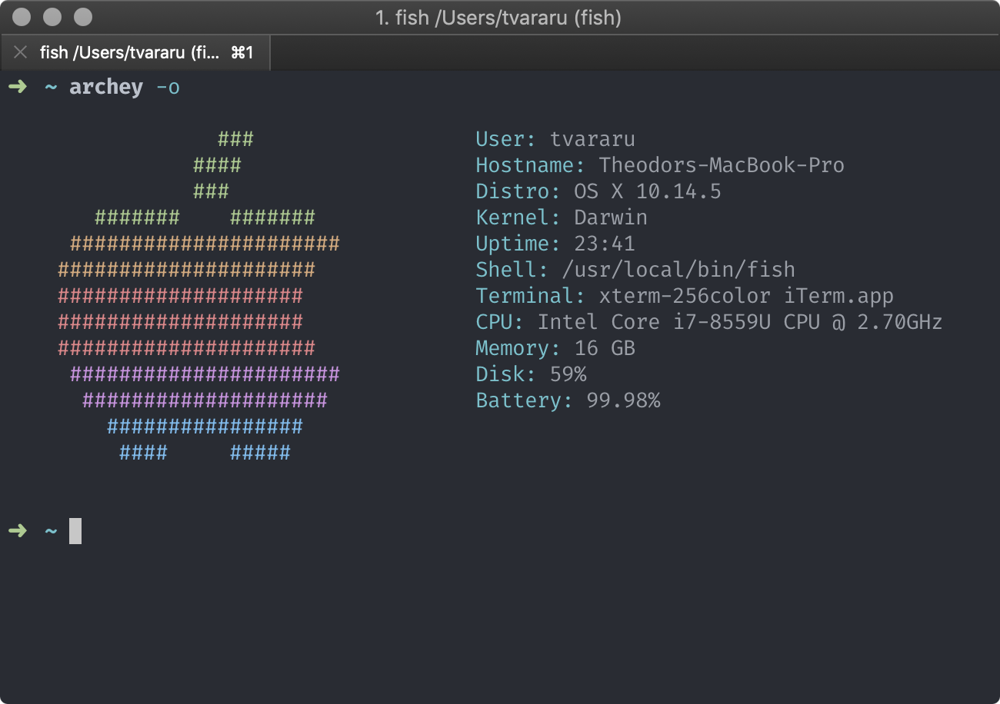

<div align="center">
  
</div>

# dotfiles.

Actually, mostly just shell scripts. OSX-only for now, but I'll make it OS independent when I actually get the need to do so.

### Installation

:warning: I haven't touched these scripts in a while, so they may be stale. Use at your own risk. :warning:

Run this inconspicuous `curl` pipe to `sh`:

```bash
$ curl setup.vararu.me | sh
```

Or clone the repo and cherry pick whatever you want.

### Features

- Huge amount of opinionated OS X, Safari, Spotlight, and misc app defaults, in [osx.sh](defaults/osx.sh).
- Installs `brew` and `brew cask` if not already present, as well as a lot of essential (and non-essential) console line applications ([brew-install.sh](homebrew/brew-install.sh)) and GUI applications ([brew-cask-install.sh](homebrew/brew-cask-install.sh)).
- Installs and configures `zsh` with `oh-my-zsh` as the default shell, and adds a few extra [exports](.oh-my-zsh-custom/exports.zsh) and [aliases](.oh-my-zsh-custom/aliases.zsh) on top.

### Credits

- [Mathias Bynens](https://github.com/mathiasbynens/dotfiles)
- [Steve Losh](https://bitbucket.org/sjl/dotfiles/src/e8ba45f413665278c11f2de3a1d67a1da3832d34/osx.sh?at=default)
- [Gary Bernhardt](https://github.com/garybernhardt/dotfiles)
- [vladh](https://github.com/vladh/dotfiles)
- [secrets.blacktree.com](http://secrets.blacktree.com)

### License

MIT.
